# The Design of Five-stage Pipeline Processor base on MIPS32
This document is an technical report for [ACMCA2016](http://202.120.38.22:1000/wiki/index.php?title=Course:ACMCA2016) Summer Session Project. In this project, a simple five-stage mips32 pipeline processor is implemented in __Verilog HDL__. My processor have fully supported the integer instruction set of MIPS32 and successfully passed all test cases.

## Overview
I implementation is mainly followed with [this blog](http://blog.csdn.net/leishangwen/article/category/5723475/3). It is designed in __Harvard Structure__ rather than von Neumann Structure. All the instructions are stored in the ROM and all the data is stored in another separated memory (RAM), so that it easily prevents structure hazard.

Main features of my mips32 processor:

- five-stage integral pipeline, including: __instruction fetch__, __instruction decode__, __execution__, __memory access__, __write back__.
- 32-bit data and address bus width.
- 32 general purpose working registers.
- support __multi-cycle instructions__.
- support __branch delay slots__ but not support __load delay slot__.

The source code is available on github: https://github.com/RunzheYang/mips32-cpu.

## Implementation

There are 17 worked modules in my implementation: 

- __Pipeline Stage Modules (3)__: _decode.v_, _execute.v_, _memory.v_
- __Stage Switch Modules (4)__ : *if_id.v*, *id_ex.v*, *ex_mem.v* and *mem_wb.v*
- __Register Modules (4)__ : *pc_reg.v*, *reg_file.v*, *hilo_reg.v*, *llbit_reg.v*
- __Memory Manager Modules (2)__ : *inst_rom.v*, *data_ram.v*
- __Control Module (1)__: *ctrl.v*
- __Division Module (1)__: *div.v*
- __Integration Modules (2)__: *cpu.v*, *sopc.v*

The function of integration module is connecting each module with wires. Control module is and clean related Stage Switch Module. And all the constants are defined in a single file *const.v*. I run tests with the file *sopc_tb.v* in experiment to observe the waveforms through the GTKWave.

### System-on-a-Programmable-Chip
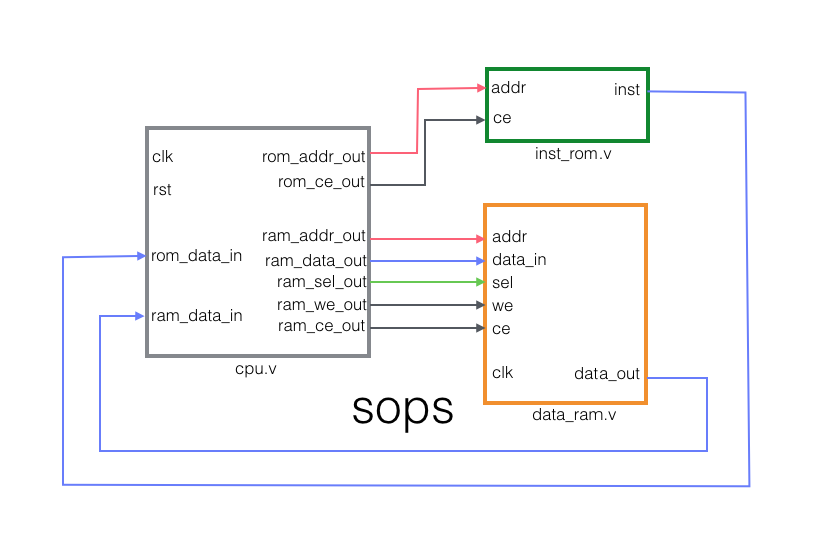
As the figure shows, the minimal SOPC used in this experiment contains three components, the CPU, ROM and RAM. They are connected with several wires for  data transfer. The ROM provides with instructions and there is no write operation for it. The RAM stores run-time data, and it should be able to support both read and write operations. _clk_ and _rst_ are two port accepting clock signal and reset signal.

### Instruction Fetch
Related modules: *pc_reg.v*, *inst_rom.v*, *control.v*.
The function of *pc_reg.v* is to compute and store the address of current instruction. *inst_rom.v* will read the address sent by *pc_reg.v* and then send the corresponding instruction to the *if_id.v* module. 
Since this mips32 processor supports multi-cycle instructions, in *pc_reg.v* I use a port *stall* to receive the command from *control.v* to keep PC unchanged if there is a multi-cycle instruction on the pipeline. Further, for supporting jump and branch, I preserve two ports *branch_flag_in* and *branch_tar_addr_in* to receive the signal from instruction decode stage.
(An illustration will be post here soon)

### Instruction Decode
Related modules: *decode.v, reg_file.v*, *control.v*.
The mission of this stage is to translate the instruction and extract the source operand from the instruction. The *decode.v* module parse the instruction to get the *aluop* (ALU operation type) and *alusel* (ALU result selection) and require the corresponding data form *reg_file.v*, then send all these information to the *id_ex.v* module.
For supporting **branch delay slot**, the *decode.v* is designed with two ports *in_delayslot_in* and *next_inst_delayslot_out*. Since it doesn't support **load delay slot**, *ex_aluop_in* is a load instruction and share the same source operand register with current instruction, it will send a stall signal to the *ctrl.v*.
```verilog
    // solving load cause data hazard by a stall request
    assign stall_req = stall_src1_loadrelated | stall_src2_loadrelated;
```
(An illustration will be post here soon)

### Execution
Related modules: *execution.v*, *div.v*, *control.v*.
The *execution.v* module works for calculation the result of instruction. To avoid **Data Hard**, I use *dest_data_out* will also send to *decode.v* module to achieve __forwarding__. Because *madd*, *maddu*, *msub* and *msubu* will occupy 2 cycles, then *execution.v* module also be able to send *stall* request to the *ctrl.v* module. *div* and *divu* will use 32 cycles to calculate the quotient and remainder, and store them in the *hilo_reg*. A *div.v* module is designed for accomplishing that.
(An illustration will be post here soon)

### Memory Access
Related modules: *memory.v*, *llbit_reg.v*, *control.v*.
The *memory.v* module is used to store or fetch data as store or load instruction command. The calculation of target address is also included in this part. Since the load instruction may cause a data hazard, *memory.v* module is also able to send the *stall* request. *ll* and *sc* are two special instructions which need a LLbit register to check whether the RMW series is undisturbed.
(An illustration will be post here soon)

### Write Back
Related modules: *reg_file.v*, *hilo_reg.v*.
The write back stage is completed by the registers themselves. When the register receives a _WriteEnable_ signal, it will update the specified address to new coming data.

## Experiment and Result
### Logical & Bitwise Shift
[Test Case: LogicShift.S]()
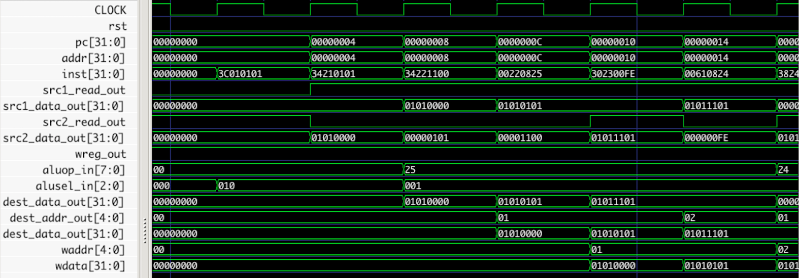
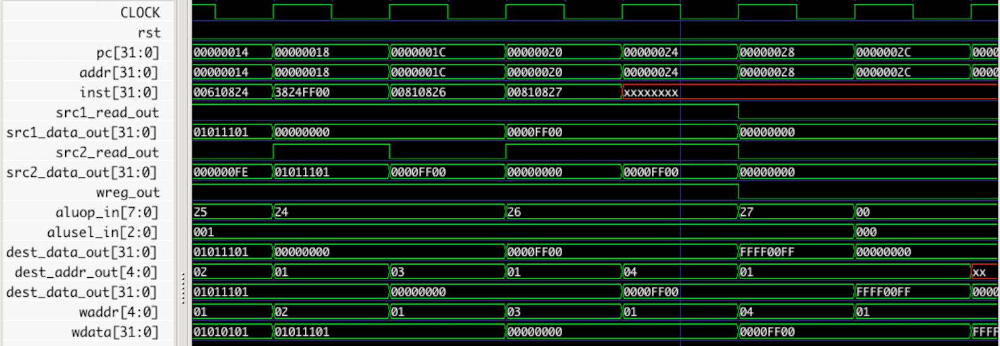
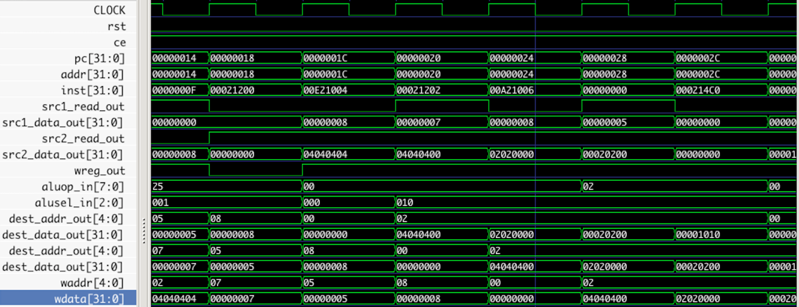
### Data Transfer (move)
[Test Case: Move.S]()
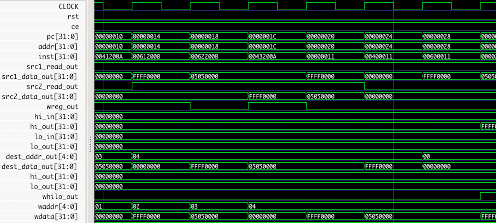
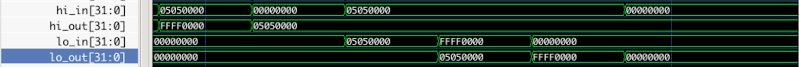
### Arithmetic
[Test Case: SimpleArithematic.S]()
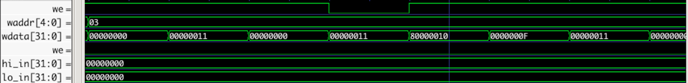
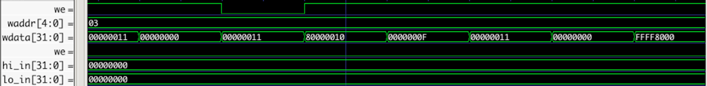
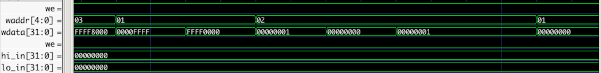
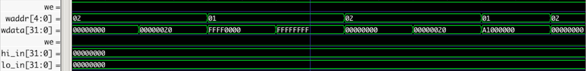
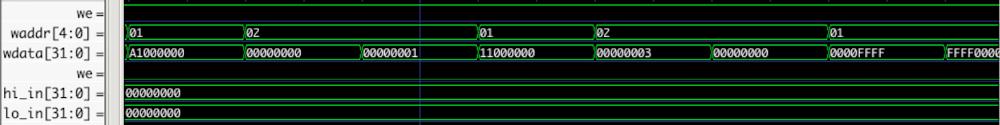
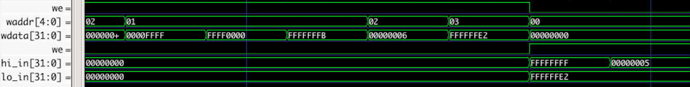

[Test Case: MultiCycle.S]()
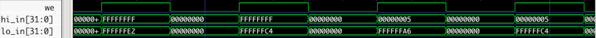
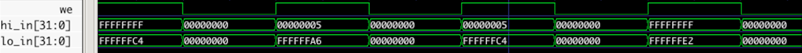

[Test Case: Div.S]()
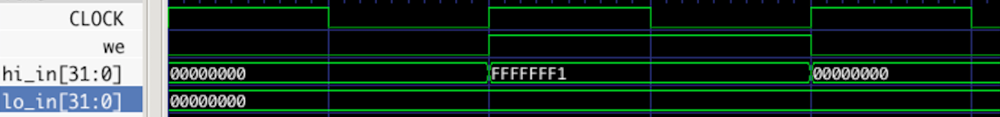
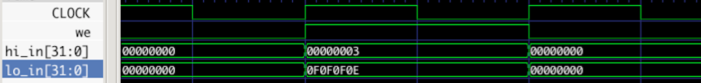
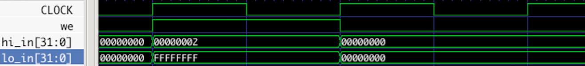
### Conditional branch & Unconditional jump
[Test Case: Jump.S]()
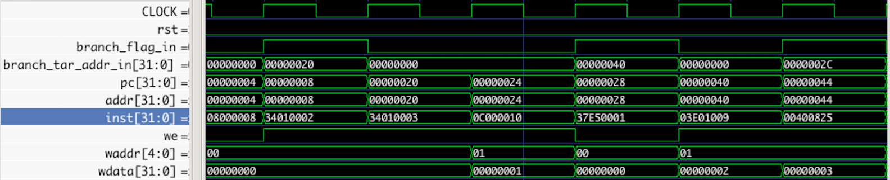
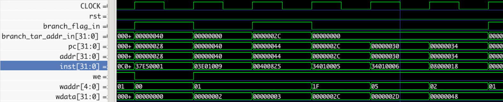
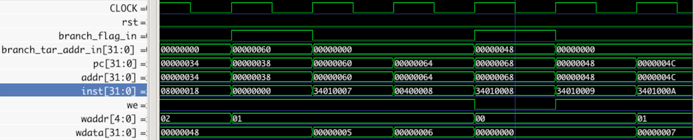

[Test Case: Branch.S]()
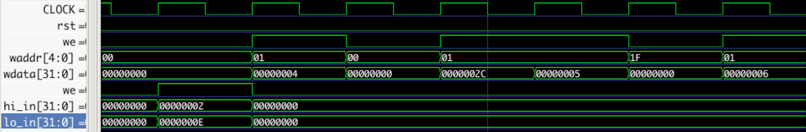

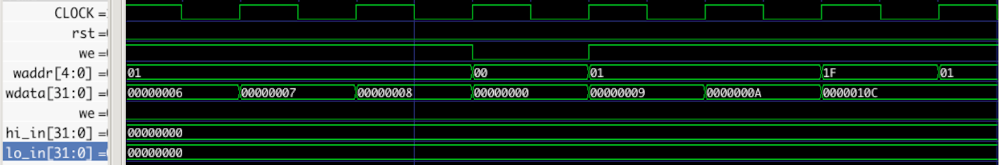
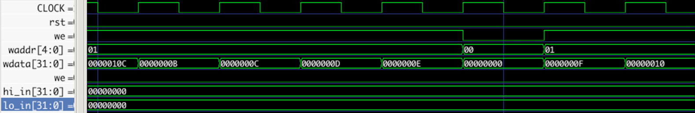
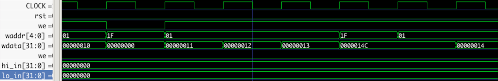
### Data Transfer (load, store)
[Test Case: LoadStore.S]()
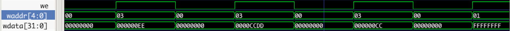
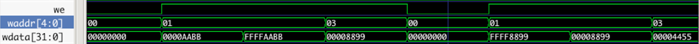
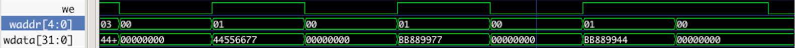
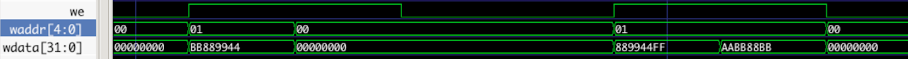

[Test Case: LlSc.S]()
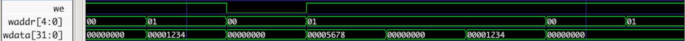
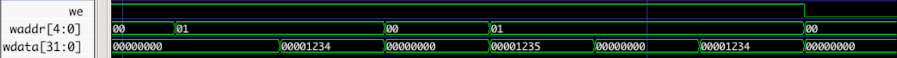

## Future Work
- __Exception and Interrupt Handling__: Up to now my processor supports many instructions while most of them are used to do calculation. A real processor should be able to do more operations such like exception and interrupt handling, for running a modern operation system. To support exception and interrupt handling, there is a need to implement _the co-processor CP0_.
- __Dynamic Scheduling__:  An out-of-order execution with Tomasulo algorithm is also in my plan, since multiple issue and multiple ALUs significantly improve the efficiency of the processor.
- __Branch Predictor__:  A branch predictor tries to guess which way a branch will go before this is known for sure. It is a common way to help pipelined processor achieve high effective performance.

## References
1. 雷思磊. _自己动手写 CPU_. 电子工业出版社, 2014.
2. Yamin Li. _Computer Principles and Design in Verilog HDL_. Tsinghua University Press, 2011.
3. J.L. Hennessy, D.A. Patterson, and K. Asanovi´c. _Computer Architecture: A Quantitative Ap- proach. Computer Architecture: A Quantitative Approach._ Morgan Kaufmann/Elsevier, 2012.
4. molfat. _MIPS processor with a 5-stage pipeline._ Github. https://github.com/molfat/cpu-mips.
5. Mips instruction set: https://en.wikipedia.org/wiki/MIPS_instruction_set

## Author Info
__Runzhe Yang (ID: 5140309562)__
[ACM Honored Class](http://acm.sjtu.edu.cn/home)
[Zhiyuan College, Shanghai Jiao Tong Univ.](http://zhiyuan.sjtu.edu.cn)
